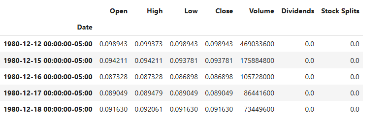
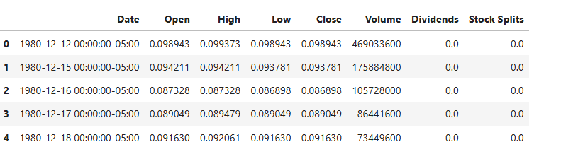
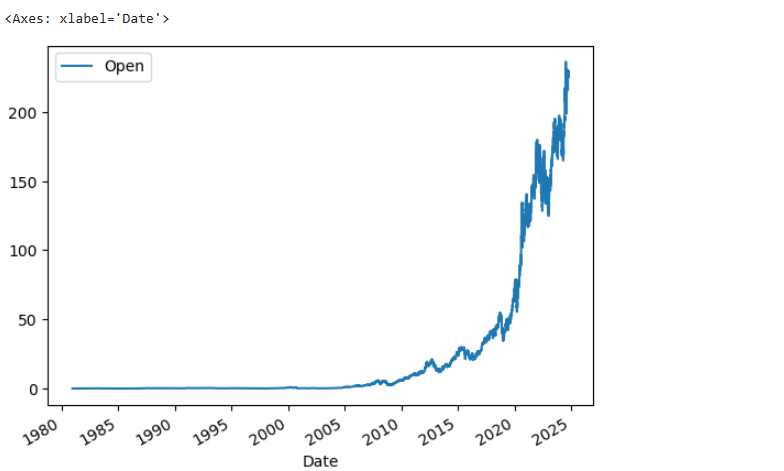
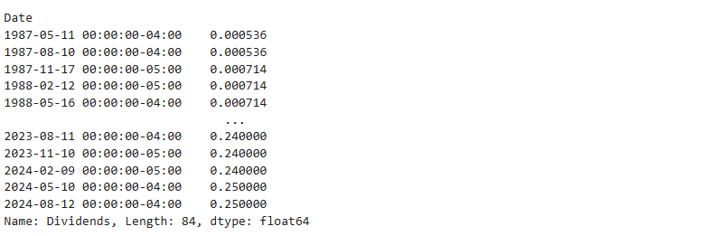
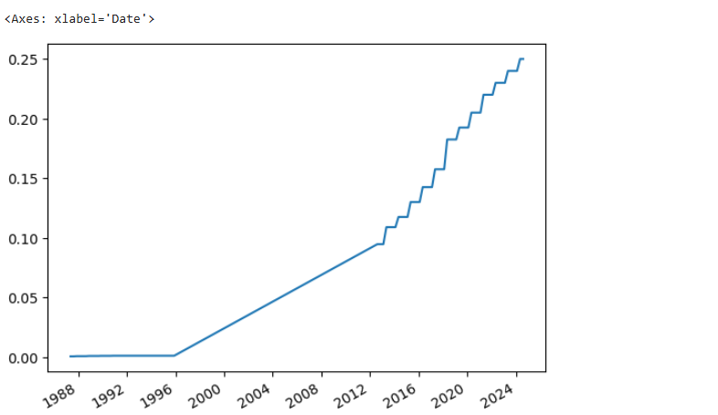
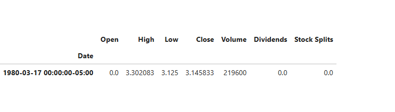
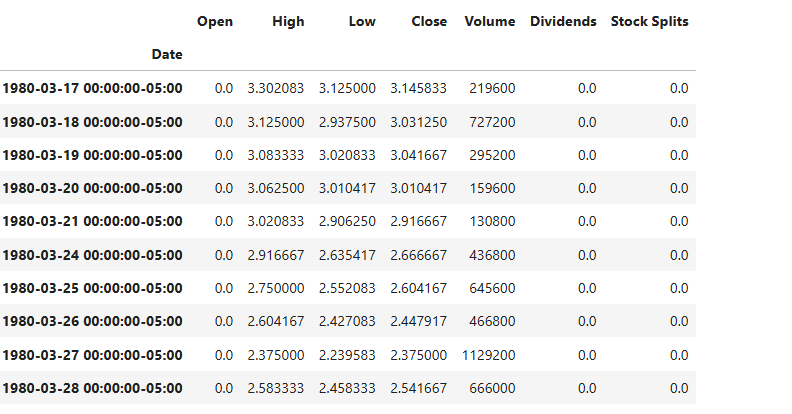
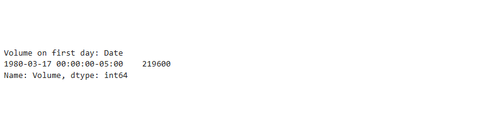

# Extracting-Stock-Data-Using-a-Python-Library

## Project Overview

This project focuses on extracting stock data using the `yfinance` library in Python. The goal is to analyze stock share prices and dividends to identify any suspicious stock activity, which is crucial for data scientists working in hedge funds.

## Table of Contents
- Installation
- Usage
- Data Extraction
- Exercises
- License

## Installation

To get started, install the required libraries using pip:

```
pip install yfinance pandas matplotlib
```

## Usage

In your Python scripts or Jupyter notebooks, you can use the following import statements:

```
import yfinance as yf
import pandas as pd
import matplotlib.pyplot as plt
```

## Data Extraction
Using yfinance to Extract Stock Info
You can extract stock information by creating a Ticker object. For example, to extract data for Apple Inc. (AAPL):

```
apple = yf.Ticker("AAPL")
```

## Stock Info
To get detailed information about the stock:

```
apple_info = apple.info
print("Country:", apple_info['country'])
```

## Extracting Share Price Data
To get historical share price data:

```
apple_share_price_data = apple.history(period="max")
apple_share_price_data.head()
```


Then to reset the index of the table:
```
apple_share_price_data.reset_index(inplace=True)
print(apple_share_price_data.head())
```


## Plotting Share Prices
You can visualize the Open prices using:

```
apple_share_price_data.plot(x="Date", y="Open")
plt.show()
```



## Extracting Dividends
To get dividend data:

```
apple_dividends = apple.dividends
print(apple_dividends)
```


## Plotting Dividends
Visualize dividends over time:

```
apple.dividends.plot()
plt.show()
```


## Exercises
### Create a Ticker object for AMD (Advanced Micro Devices):

```
amd = yf.Ticker("AMD")
```

### Extract the country and sector for AMD:

```
amd_info = amd.info
print("Country:", amd_info['country'])  # 'United States'
print("Sector:", amd_info['sector'])    # 'Technology'
```

### Retrieve the historical stock data and find the volume traded on the first day:
You could run this code to show you the row that shows the 1st day of trading
```
x=amd.history(period = "max")
x.head(1)
```


Alternatively, you could run this code to show you the 1st ten rows of trading
```
x=amd.history(period = "max")
x.head(1)
```


Also, you could specifcally determine the volume of the 1st day by calling it directly
```
x=amd.history(period = "max")
first_day_volume = x.head(1)['Volume']
print("Volume on first day:", first_day_volume)
```



